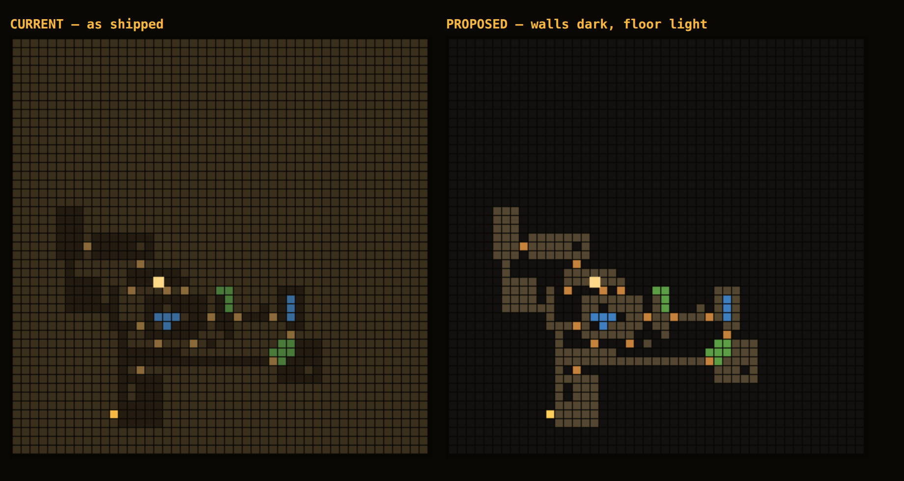

# Why a floor feels boring, empty and compact

A side-by-side of a Shattered Pixel Dungeon depth 1 against a Cantori depth 1 turned up
four separate problems that all land as the same complaint. They are separable, they are
independently fixable, and one of them is not a generator problem at all.

Every number below comes from `node tools/floor_stats.js`, which is checked in next to this
document. Rerun it after any change to the generator — the numbers are the point, and the
generator has already been re-tuned twice on eyeballed screenshots, once in a direction
that made a measured problem worse.

```
60 floors at depth 1 (forest), as shipped:

  rooms per floor        10.0   of which attached 8.1
  room area              mean 19.2  median 18  p90 30  max 36
  biggest room per floor 33.2
  a side of 3 or less    58%
  used extent            28.4 x 29.0 of 47 x 47
  start -> stairs        24.1 steps
  corridor share         24.6% of walkable
  rooms with a monster   48%      an item 44%     terrain 34%     a pillar 44%
  terrain tiles/floor    20.5 (8.2% of walkable)
  fully visible from a doorway   95%
  floor-map wall vs floor contrast   1.34:1 walked, 1.28:1 mapped
```

---

## 1. The floor map cannot draw the floor

**This is the one that made the screenshot look the way it did, and it is not the
generator's fault.** `drawMap` fills a wall cell and a floor cell in two browns that are
one-and-a-bit to one apart:

| | wall | floor | contrast |
|---|---|---|---|
| walked | `#4b3d27` | `#332a1c` | **1.34 : 1** |
| merely mapped | `#3a2f1d` | `#241c11` | **1.28 : 1** |

3:1 is the accepted floor for a non-text graphic. At 1.3 the two are the same colour on a
phone, so the map renders as one undifferentiated brown mass and the architecture — which
is actually there — is invisible. A magic-mapped floor is the worst case, because then
*everything* is in the dim pair and there is no bright walked region to read the shape
against.



Left is the map as shipped. Right is the identical floor with walls pushed to near-black
and floor lifted to a light stone. Nothing about the generator changed between those two
images.

The existing comment on those colours says they were *lifted* so a magic-mapped room would
not vanish into the background. That was the right diagnosis and the wrong fix: lifting
floor toward wall solved "floor is invisible against the void" by creating "floor is
invisible against wall". The fix is to separate the pair — drop wall, raise floor — not to
move them together.

**Fix:** `drawMap` only. Keep the walked/mapped brightness distinction (it is the legend's
whole content) but open the wall/floor gap to at least 3:1 in both pairs.

---

## 2. Well over half the rooms are not rooms

`LAYOUT_DEFAULT.roomSideMin` is **2**, so `generateLevel` draws `w` from 3–7 and `h` from
2–6. **58% of rooms have a side of three tiles or less.** A 6×2 or a 3×3 is a slot, an
alcove, a cupboard — not a space you can fight in, and not a space that can hold anything
worth finding.

Then `roomAreaMax` is **36**, a hard ceiling, and the biggest room on a floor averages
**33.2**. Every floor's largest space is the same size as every other floor's largest
space. There is never a hall, never a cavern, never a room you walk into and register as
*somewhere*. Compare the SPD screenshot: there is an obvious big chamber, obvious small
side rooms, and the difference between them is what makes the floor navigable from memory.

The Crypt is the one biome that authors its own `layout` block, and it is the opposite
extreme — 4.2 rooms at a mean of 80 tiles, nothing attached:

```
30 floors at depth 11 (crypt):
  rooms per floor  4.2   attached 0.0
  room area        mean 80.3  median 80  max 120
  a side of 3 or less  0%
  rooms with a pillar  99%    completely bare  0%
```

Four enormous halls is its own problem, but note that *nothing there is bare*. The two
authored extremes bracket what is missing: many rooms, of genuinely different sizes.

**Fix:** replace the flat `roomSideMin…roomSideMax` band with a size-category roll, which
is what actually produces the mix — mostly normal rooms, a couple of small ones, and **one
large room per floor** that the area cap currently forbids. `roomSideMin` should be 4 at
the smallest, so the smallest thing the generator calls a room is 4×4.

---

## 3. There is exactly one kind of room

This is the real "boring", and it is the largest piece of work.

Every room on a Cantori floor is painted the same: bare floor, plus pillars if it is big
enough, plus whatever the biome's terrain painter happened to drop on it. `placeTrees`
skips any room of 20 tiles or less, and 62% of rooms come in at or under that — so
**only 44% of rooms carry a pillar**. The forest terrain block is 1–2 water pools of 4–10 tiles and 2–4 grass
patches of 3–6, which works out to **8.2% of walkable tiles**, scattered as small blobs
rather than filling anything.

The SPD floor in the comparison has, in one screen: a chamber whose floor is entirely
grass, two rooms built around water, a room floored in wood rather than stone, and plain
rooms in between. Not one of those is a different *tile* doing something clever. They are
the same handful of tiles arranged as a **room type** — a place with a character, which
you recognise on sight and remember afterwards. That is the whole mechanism, and Cantori
has no equivalent.

Thorn vaults and secret nooks are the two room types that do exist, and they are exactly
the right shape for this: a room the floor treats differently. There just need to be a
dozen more of them, and they need to be ordinary rather than rare.

**Fix: this is already in the queue as C4 + C5** (`generalize makeThornVaults into a room
template system`, then `six room templates as data`). Neither has a brief yet. Nothing
below changes that plan — it is the argument for moving them up the queue, plus a longer
candidate list.

A room-painter registry in `game.js`, driven by a weighted list per biome in `data.js`
(CLAUDE.md rule 1 — the *mechanism* is code, the roster is content), and taught to
`editor.js` in the same commit (rule 2). Candidates that need no new tile and no new
predicate, so none of them touch rule 5:

| room | painter | already have |
|---|---|---|
| garden | fill most of the room with `GRASS` | `GRASS`, `conceals` |
| pool | a `WATER` body with a walkable rim, item on an island | `WATER`, the deep-water connectivity vetting |
| statuary | pillars in a deliberate pattern, not scattered | `placeTrees`, `sarcophagi` painting |
| pillared hall | a colonnade down a large room | same |
| bramble | `THORN` as an obstacle course rather than a vault seal | `THORN`, `makeThornVaults` |
| rubble field | `RUBBLE` over most of the floor | `RUBBLE` |
| storage | several items, tightly packed, pillars between them | `spawnItems` |
| nest | one monster type, several of them, asleep | `spawnMonsters` |

Every one of those reuses machinery that is already written and already proven against the
connectivity rules. The new code is the registry and the per-room dispatch, not the
painters.

---

## 4. Packing removed the journey

`attachPct` is **85** and `roomPad` is **2**, so **8.1 of 10 rooms** are placed flush
against a neighbour with a single doorway between them, and corridor is down to **24.6% of
walkable**. You do not walk a hall and arrive somewhere; you step through a doorway from
one box into the next box, ten times.

The comment in `LAYOUT_DEFAULT` is explicit that this was deliberate: packing took the used
extent from 36² to 29² and the walk from 30 steps to 24, "which is what 'the floor feels
empty' was actually about". That change did what it set out to do — the floor is measurably
less empty of *walking*. But the emptiness being complained about now is emptiness of
*content*, and packing made that worse, because it deleted the corridors that give a room
its edges. A room only reads as a room if there is a not-room next to it.

It also explains the second half of the complaint exactly. **"Boring and empty" and "too
compact" are the same change, seen from both ends.**

**Fix:** `attachPct` back to roughly 40–50 and `roomPad` to 3, and buy the density back
through §2 and §3 instead — a floor is dense because its rooms hold things, not because
its rooms touch.

---

## 5. Falling out of the above: nothing is ever a surprise

**95% of rooms are entirely inside FOV radius 6 from one of their own doorways**, and the
mean share of a room visible from its best doorway is 100%. You stand in the threshold, see
every monster in the chamber, and have resolved the encounter before entering it.

The comment on `FOV_RADIUS` argues for 6 on exactly the grounds that this cannot happen:
"at 6 a room has to be walked into, and a big one still has corners you have not looked
at." That was true when it was written. The room-shrink pass silently invalidated it —
nothing links the two constants, so shrinking rooms moved them past the radius without
anything complaining.

This needs no fix of its own. §2 and §3 fix it: rooms with a long axis past 6, and pillars
and grass inside them, restore the corners the radius was chosen for. It is listed here
because it is the measurement to re-check afterwards — if §2 and §3 land and this is still
above about 60%, the rooms did not actually get bigger.

---

## Order to do them in

1. **§1 — E5, the map colours.** Smallest change in the document, fixes the thing the
   screenshot was actually showing, and independent of everything else. `drawMap` only.
2. **§2 + §4 — C6, the layout numbers.** Both are `LAYOUT_DEFAULT` and the room-size roll
   in `generateLevel`; doing them separately means measuring two intermediate states that
   will never ship. Rerun `tools/floor_stats.js` and `tests/smoke.js` — packing and room
   size both feed the connectivity guarantee, and `--floors 200` is cheap insurance against
   a rare unwinnable seed.
3. **§3 — C4 then C5, room types.** The real work, and it wants C6 underneath it rather
   than the other way round: a garden painter has nothing to paint in a 6×2 slot.

§5 is not a task. It is the acceptance test for C6 and C5.

---

# The doors-and-connectors rule

Decided after the measurements above. A **connector** is a stretch of corridor between
rooms; it is the punctuation that makes a room read as a room. The invariant:

> **Every non-wall tile on a room's boundary is a door, and every door fronts a connector.**
> No undoored room mouths, no doors that open onto anything but a connector, and no doors
> part-way along a connector.

A connector is doored at **every** mouth, not just one — a junction corridor touching three
rooms carries three doors. This applies to all five biomes. Boss depths are hand-laid
arenas that never run `placeDoors`, and the merchant den is a single room; both stay
exempt.

Two things sit outside the rule by construction, and both are closets:

- **A cell** is a single-door closet inside a broader room — a room within a room. Its door
  opens onto its containing room, not onto a connector. Not built yet; the rule is written
  to leave room for it rather than to be amended later.
- **A secret room** is the same closet, reached from a connector through a door that reads
  as wall until it is found.

## What that costs, measured

| | as shipped | under the rule |
|---|---|---|
| connector mouths with no door | 6.4/floor (43%) | 0 |
| doors with no connector behind them | 7.2/floor (87% of seams) | 0 |
| doors part-way along a connector | 0.00/floor | 0 |
| connectors doored at every mouth | 29% | 100% |

The middle row is the whole of the current flush-attach behaviour: `attachPct` is 85, so
8 of 10 rooms share a wall with a neighbour and open through a doorway with no hallway
behind it. Every one of those doors is illegal under the rule.

## Attached rooms become one room

The resolution is not to delete the door but to delete the seam: two rooms placed flush
**merge into a single L-shaped room**, one continuous space with one boundary, so there is
nothing there to door. This buys irregular room outlines for free, which is worth having on
its own — every room in the game today is a rectangle.

**Merging cannot be done at `attachPct: 85`.** `placeAdjacent` attaches each new room to a
*random* existing one, so attachment chains, and a chain merges end to end. Simulated over
60 floors, fusing every attached group at today's settings leaves **2.1 rooms per floor**,
mean area 90, max 199 — 44 of 60 floors collapse to one or two enormous amoebas. A union
of attached rooms is not a room.

Capping a merge at an actual **pair** — a greedy matching, so a rect fuses with at most one
partner — stops the runaway. `attachPct` then stops meaning "how many rooms lack a hallway"
and starts meaning **"how many rooms are L-shaped rather than rectangular"**, which is a
knob worth having.

With pairs capped, sweeping the room budget (base rect side 4–8, `roomAreaMax` 42,
`roomPad` 3, `attachPct` 50, 40 floors each):

```
 roomTarget | rects  rooms  meanArea  median  biggest  L-shaped  extent
        320 |  10.5    6.9        49      50       73      53%      37
        400 |  13.1    8.6        49      45       75      53%      38
        480 |  15.4    9.9        50      52       76      55%      40
```

Against today's floor, `roomTarget: 480` holds the room count and changes everything else:

| | as shipped | proposed |
|---|---|---|
| rooms per floor | 10.0 | 9.9 |
| mean room area | 19 | 50 |
| median room area | 18 | 52 |
| biggest room | 33 | 76 |
| rooms with a side ≤ 3 | 58% | 0 (min side is 4) |
| non-rectangular rooms | 0% | 55% |
| used extent | 28 × 29 | ~40 × 40 |

`generateLevel` caps placement at `rooms.length < 22`; at 15.4 rects that cap is close
enough to matter and should go up with the budget.

## Every stub ends in a secret

A connector reaching only one room is a stub. **A stub must terminate in a secret** — at
minimum a door that looks like wall until it is searched out, with a closet behind it.

`resolveDeadEnds` is most of the way there already: it converts up to `SECRET_MAX = 2` dead
ends per floor into exactly this (an ordinary `WALL` tile that opens on a search, a stocked
3×3 room behind it) and **seals the rest back to the junction**. The change is that sealing
stops being an outcome: every stub gets the secret. The existing comment argues the floor
must be able to promise that a passage goes somewhere — this keeps that promise and pays
more of them, which also makes searching always worth the turns.

Raising `SECRET_MAX` means the loot budget per floor has to be looked at in the same pass;
2.78 stub-shaped connectors per floor is several times today's two.

## What this does to the other findings

§2 and §5 come out largely fixed as a side effect: a minimum side of 4 and a median area of
52 means no more closets-called-rooms, and a room that size is no longer swallowed whole by
FOV radius 6 from its doorway. §4 is the rule itself. §1 and §3 are untouched and still
stand on their own.

**Re-measure with `node tools/floor_stats.js` after any of it**, and add the invariant to
`tests/smoke.js` as an assertion — it is exactly the kind of property that holds for fifty
floors and then quietly stops.
